# Modelo de Dominio

[← Volver al índice](../README.md) | [← Arquitectura](./03_arquitectura.md) | [Base de Datos →](./05_base_datos.md)

## 1. Introducción

Este documento describe las entidades del dominio, sus atributos, relaciones y comportamientos. El modelo está diseñado para soportar el sistema de eventos con **10 tipos de eventos fijos**, cada uno con su propia tabla en la base de datos, garantizando integridad referencial y validaciones específicas por tipo de evento.

## 2. Diagrama de Clases (PlantUML)

```plantuml
@startuml

!define ENTITY class
!define ENUM enum

' === Catálogos Base ===
ENTITY Field {
  + id: UUID
  + name: String
  + code: String {unique}
  + surface_ha: Decimal
  + notes: Text
  + is_active: Boolean
  + created_at: DateTime
  + updated_at: DateTime
  --
  + get_current_campaign(): Campaign
  + get_events(date_from, date_to): List[Event]
}

ENTITY Campaign {
  + id: Integer
  + name: String
  + season: String
  + variety: String
  + start_date: Date
  + end_date: Date
  + notes: Text
  + is_active: Boolean
  + created_at: DateTime
  + updated_at: DateTime
  --
  + is_current(): Boolean
  + get_total_events(): Integer
}

ENTITY Station {
  + id: Integer
  + name: String
  + field: Field
  + station_type: String
  + notes: Text
  + is_operational: Boolean
  + installed_at: Date
  + created_at: DateTime
  --
  + get_latest_readings(): List[Variable]
}

' === Sistema de Eventos ===
ENTITY EventType {
  + id: Integer
  + name: String {unique}
  + category: String
  + description: Text
  + is_active: Boolean
  + icon: String
  + color: String
  + created_at: DateTime
  + updated_at: DateTime
  --
  + get_active_events(): List[Event]
}

ENTITY Event {
  + id: UUID
  + event_type: EventType
  + field: Field
  + campaign: Campaign
  + timestamp: DateTime
  + observations: Text
  + created_by: User
  + created_at: DateTime
  + updated_at: DateTime
  --
  + validate(): Boolean
  + get_summary(): String
  + get_attachments(): List[Attachment]
}

' === Eventos Específicos (Herencia de Event) ===
ENTITY IrrigationEvent {
  + metodo: String
  + duracion_minutos: Integer
  + fuente_agua: String
  + volumen_m3: Decimal
  + presion_bar: Decimal
  + ce_uScm: Decimal
  + ph: Decimal
}

ENTITY FertilizationEvent {
  + tipo_fertilizante: String
  + nombre_producto: String
  + dosis_total_kg: Decimal
  + metodo_aplicacion: String
  + area_aplicada_ha: Decimal
  + npk_formula: String
}

ENTITY PhytosanitaryEvent {
  + tipo_producto: String
  + nombre_producto: String
  + ingrediente_activo: String
  + dosis_total_l_kg: Decimal
  + metodo_aplicacion: String
  + area_tratada_ha: Decimal
  + plagas_objetivo: String
  + intervalo_seguridad_dias: Integer
}

ENTITY MaintenanceEvent {
  + tipo_labor: String
  + descripcion: String
  + area_intervenida_ha: Decimal
  + horas_hombre: Decimal
  + maquinaria_utilizada: String
}

ENTITY MonitoringEvent {
  + tipo_monitoreo: String
  + parametros_medidos: String
  + resultados: String
  + area_muestreada_ha: Decimal
  + numero_muestras: Integer
  + hallazgos_relevantes: String
}

ENTITY OutbreakEvent {
  + tipo_organismo: String
  + nombre_organismo: String
  + nivel_severidad: String
  + area_afectada_ha: Decimal
  + poblacion_estimada: String
  + estado_fenologico: String
  + acciones_tomadas: String
}

ENTITY ClimateEvent {
  + tipo_evento: String
  + temperatura_min_c: Decimal
  + temperatura_max_c: Decimal
  + precipitacion_mm: Decimal
  + humedad_relativa_pct: Decimal
  + velocidad_viento_kmh: Decimal
  + descripcion_condiciones: String
}

ENTITY HarvestEvent {
  + tipo_cosecha: String
  + cantidad_kg: Decimal
  + calidad: String
  + destino: String
  + cuadrillas: Integer
  + horas_cosecha: Decimal
}

ENTITY PostHarvestEvent {
  + tipo_proceso: String
  + lote_procesado: String
  + cantidad_entrada_kg: Decimal
  + cantidad_salida_kg: Decimal
  + merma_pct: Decimal
  + temperatura_almacen_c: Decimal
  + duracion_proceso_horas: Decimal
}

ENTITY LaborCostEvent {
  + tipo_labor: String
  + descripcion: String
  + numero_trabajadores: Integer
  + horas_totales: Decimal
  + costo_total_mxn: Decimal
  + tipo_pago: String
}

ENTITY Attachment {
  + id: Integer
  + event: Event
  + file: File
  + file_name: String
  + file_size: Integer
  + mime_type: String
  + metadata: JSON
  + uploaded_by: User
  + uploaded_at: DateTime
  --
  + get_url(): String
  + get_preview_url(): String
}

' === Variables Ambientales ===
ENTITY Variable {
  + id: BigInteger
  + station: Station
  + field: Field
  + timestamp: DateTime
  + variable_type: String
  + value: Decimal
  + unit: String
  + source: String (manual/automatic)
  + metadata: JSON
  + created_at: DateTime
  --
  + is_within_range(): Boolean
  + get_formatted_value(): String
}

' === Seguridad y Auditoría ===
ENTITY User {
  + id: Integer
  + username: String {unique}
  + email: String {unique}
  + first_name: String
  + last_name: String
  + role: Role
  + is_active: Boolean
  + last_login: DateTime
  + created_at: DateTime
  --
  + has_permission(permission): Boolean
  + get_full_name(): String
}

ENUM Role {
  ADMIN
  SUPERVISOR
  FIELD_TECHNICIAN
  CONSULTANT
  INTEGRATION
}

ENTITY AuditLog {
  + id: BigInteger
  + user: User
  + action: String
  + entity: String
  + entity_id: String
  + timestamp: DateTime
  + ip_address: String
  + user_agent: String
  + diff: JSON
  --
  + get_description(): String
}

' === Relaciones ===
Field "1" -- "0..*" Station : has
Field "1" -- "0..*" Event : occurs_in
Field "1" -- "0..*" Variable : measures

Campaign "1" -- "0..*" Event : includes

EventType "1" -- "0..*" Event : defines_structure_for

Event "1" -- "0..*" Attachment : has
Event <|-- IrrigationEvent : extends
Event <|-- FertilizationEvent : extends
Event <|-- PhytosanitaryEvent : extends
Event <|-- MaintenanceEvent : extends
Event <|-- MonitoringEvent : extends
Event <|-- OutbreakEvent : extends
Event <|-- ClimateEvent : extends
Event <|-- HarvestEvent : extends
Event <|-- PostHarvestEvent : extends
Event <|-- LaborCostEvent : extends

Station "1" -- "0..*" Variable : records

User "1" -- "0..*" Event : creates
User "1" -- "0..*" AuditLog : performs
User "*" -- "1" Role : has

@enduml
```



## 3. Entidades del Dominio

### 3.1 Field (Lote/Parcela)

**Descripción**: Representa una unidad productiva física donde se realizan las actividades agrícolas.

**Atributos**:
| Atributo | Tipo | Descripción | Validación |
|----------|------|-------------|------------|
| id | UUID | Identificador único | PK, auto-generado |
| name | String(100) | Nombre del lote | Requerido, único en organización |
| code | String(50) | Código alfanumérico | Requerido, único |
| surface_ha | Decimal(10,4) | Superficie en hectáreas | > 0 |
| notes | Text | Descripción o datos extra del campo | Opcional |
| is_active | Boolean | Estado del lote | Default True |

**Métodos de Negocio**:
- `get_current_campaign()`: Retorna la campaña activa para el lote
- `get_events(date_from, date_to)`: Historial de eventos en rango de fechas
- `calculate_event_density()`: Eventos por hectárea en período

**Reglas de Negocio**:
- Un lote no puede eliminarse si tiene eventos asociados (eliminación lógica)
- El código debe ser único dentro de la organización

### 3.2 Campaign (Campaña/Temporada)

**Descripción**: Período de producción que agrupa eventos relacionados.

**Atributos**:
| Atributo | Tipo | Descripción | Validación |
|----------|------|-------------|------------|
| id | Integer | Identificador | PK, auto-incremento |
| name | String(100) | Nombre descriptivo | Requerido |
| season | String(50) | Temporada | Ej: "Primavera 2025" |
| variety | String(100) | Variedad de limón | Catálogo: Persa, Real, etc. |
| start_date | Date | Fecha de inicio | Requerido |
| end_date | Date | Fecha de fin | >= start_date |
| notes | Text | Notas adicionales | Opcional |
| is_active | Boolean | Campaña activa | Default True |

**Métodos de Negocio**:
- `is_current()`: Verifica si la campaña está vigente hoy
- `get_total_events()`: Cuenta eventos asociados
- `get_duration_days()`: Duración en días

**Reglas de Negocio**:
- Solo puede haber una campaña activa por lote en un momento dado
- La fecha de fin debe ser posterior a la de inicio
- No se puede eliminar una campaña con eventos asociados

### 3.3 Station (Estación de Monitoreo)

**Descripción**: Punto físico de medición de variables ambientales.

**Atributos**:
| Atributo | Tipo | Descripción | Validación |
|----------|------|-------------|------------|
| id | Integer | Identificador | PK |
| name | String(100) | Nombre | Requerido |
| field | FK(Field) | Lote asociado | Requerido |
| station_type | String(50) | Tipo | clima/suelo/multivariable |
| notes | Text | Descripción o datos extra de la estación | Opcional |
| is_operational | Boolean | Estado operativo | Default True |
| installed_at | Date | Fecha instalación | Opcional |

**Métodos de Negocio**:
- `get_latest_readings(hours=24)`: Lecturas recientes
- `get_downtime()`: Tiempo inactivo
- `check_status()`: Verifica si está enviando datos

**Reglas de Negocio**:
- Debe tener al menos una variable asociada para considerarse operativa

### 3.4 EventType (Tipo de Evento)

**Descripción**: Define los metadatos de un tipo de evento. Los tipos de eventos son **10 tipos fijos predefinidos** que se cargan mediante el comando `setup_event_types`. Cada tipo de evento tiene su propia tabla con campos específicos.

**Atributos**:
| Atributo | Tipo | Descripción | Validación |
|----------|------|-------------|------------|
| id | Integer | Identificador | PK |
| name | String(100) | Nombre | Requerido, único |
| category | String(50) | Categoría | irrigation/fertilization/etc. |
| description | Text | Descripción | Opcional |
| is_active | Boolean | Activo | Default True |
| icon | String(50) | Icono (CSS class) | Opcional |
| color | String(7) | Color hex | Ej: #28a745 |

**Tipos de Eventos Predefinidos**:

1. **Aplicación de Riego** (irrigation) - Tabla: `irrigation_events`
2. **Fertilización** (fertilization) - Tabla: `fertilization_events`
3. **Aplicación Fitosanitaria** (phytosanitary) - Tabla: `phytosanitary_events`
4. **Labores de Cultivo** (maintenance) - Tabla: `maintenance_events`
5. **Monitoreo** (monitoring) - Tabla: `monitoring_events`
6. **Brotes y Plagas** (other) - Tabla: `outbreak_events`
7. **Eventos Climáticos** (other) - Tabla: `climate_events`
8. **Cosecha** (harvest) - Tabla: `harvest_events`
9. **Poscosecha** (postharvest) - Tabla: `postharvest_events`
10. **Mano de Obra y Costos** (other) - Tabla: `labor_cost_events`

**Métodos de Negocio**:
- `get_active_events()`: Retorna eventos asociados activos

**Reglas de Negocio**:
- Los tipos de eventos son fijos (no se pueden crear dinámicamente)
- El nombre debe ser único
- Los administradores pueden activar/desactivar tipos
- La desactivación no elimina eventos existentes

### 3.5 Event (Instancia de Evento Base)

**Descripción**: Modelo base abstracto que contiene los campos comunes a todos los eventos. Los eventos reales se almacenan en tablas específicas que heredan de Event.

**Atributos**:
| Atributo | Tipo | Descripción | Validación |
|----------|------|-------------|------------|
| id | UUID | Identificador | PK |
| event_type | FK(EventType) | Tipo | Requerido, PROTECT |
| field | FK(Field) | Lote | Requerido, CASCADE |
| campaign | FK(Campaign) | Campaña | Opcional, SET_NULL |
| timestamp | DateTime | Fecha/hora evento | Requerido, con TZ |
| observations | Text | Observaciones | Opcional |
| created_by | FK(User) | Usuario | SET_NULL |
| created_at | DateTime | Fecha captura | Auto |
| updated_at | DateTime | Última modificación | Auto |

**Métodos de Negocio**:
- `validate()`: Valida los campos del evento
- `get_summary()`: Genera resumen legible
- `get_attachments()`: Lista de archivos adjuntos

**Reglas de Negocio**:
- El timestamp no puede ser futuro (> now + 1 hora)
- No puede modificarse el event_type una vez creado
- Las modificaciones se registran en auditoría

### 3.6 Eventos Específicos

Cada tipo de evento tiene su propia tabla con campos específicos. Todas heredan de `Event`.

#### 3.6.1 IrrigationEvent (Aplicación de Riego)

**Campos Específicos**:
| Campo | Tipo | Descripción |
|-------|------|-------------|
| metodo | String | Método de riego (Aspersión/Goteo/Surco/etc.) |
| duracion_minutos | Integer | Duración en minutos |
| fuente_agua | String | Origen del agua (Pozo/Río/Presa/etc.) |
| volumen_m3 | Decimal | Volumen aplicado en m³ |
| presion_bar | Decimal | Presión del sistema (0-10 bar) |
| ce_uScm | Decimal | Conductividad eléctrica (µS/cm) |
| ph | Decimal | pH del agua (0-14) |

#### 3.6.2 FertilizationEvent (Fertilización)

**Campos Específicos**:
| Campo | Tipo | Descripción |
|-------|------|-------------|
| tipo_fertilizante | String | Tipo (Químico/Orgánico/Foliar/etc.) |
| nombre_producto | String | Nombre comercial del producto |
| dosis_total_kg | Decimal | Cantidad aplicada en kg |
| metodo_aplicacion | String | Método (Fertirrigación/Aplicación directa/etc.) |
| area_aplicada_ha | Decimal | Área cubierta en hectáreas |
| npk_formula | String | Fórmula NPK (ej: 15-15-15) |

#### 3.6.3 PhytosanitaryEvent (Aplicación Fitosanitaria)

**Campos Específicos**:
| Campo | Tipo | Descripción |
|-------|------|-------------|
| tipo_producto | String | Tipo (Insecticida/Fungicida/Herbicida/etc.) |
| nombre_producto | String | Nombre comercial |
| ingrediente_activo | String | Ingrediente activo principal |
| dosis_total_l_kg | Decimal | Cantidad aplicada (L o kg) |
| metodo_aplicacion | String | Método de aplicación |
| area_tratada_ha | Decimal | Área tratada en hectáreas |
| plagas_objetivo | String | Plagas o enfermedades objetivo |
| intervalo_seguridad_dias | Integer | Días hasta cosecha segura |

#### 3.6.4 MaintenanceEvent (Labores de Cultivo)

**Campos Específicos**:
| Campo | Tipo | Descripción |
|-------|------|-------------|
| tipo_labor | String | Tipo (Poda/Deshierbe/Raleo/etc.) |
| descripcion | String | Descripción detallada |
| area_intervenida_ha | Decimal | Área trabajada |
| horas_hombre | Decimal | Horas de trabajo |
| maquinaria_utilizada | String | Equipos utilizados |

#### 3.6.5 MonitoringEvent (Monitoreo)

**Campos Específicos**:
| Campo | Tipo | Descripción |
|-------|------|-------------|
| tipo_monitoreo | String | Tipo (Fitosanitario/Fenológico/Suelo/etc.) |
| parametros_medidos | String | Variables monitoreadas |
| resultados | String | Resumen de resultados |
| area_muestreada_ha | Decimal | Área muestreada |
| numero_muestras | Integer | Cantidad de muestras |
| hallazgos_relevantes | String | Hallazgos importantes |

#### 3.6.6 OutbreakEvent (Brotes y Plagas)

**Campos Específicos**:
| Campo | Tipo | Descripción |
|-------|------|-------------|
| tipo_organismo | String | Tipo (Plaga/Enfermedad/Maleza) |
| nombre_organismo | String | Nombre científico o común |
| nivel_severidad | String | Severidad (Bajo/Medio/Alto/Crítico) |
| area_afectada_ha | Decimal | Área afectada |
| poblacion_estimada | String | Estimación de población |
| estado_fenologico | String | Estado del cultivo |
| acciones_tomadas | String | Medidas aplicadas |

#### 3.6.7 ClimateEvent (Eventos Climáticos)

**Campos Específicos**:
| Campo | Tipo | Descripción |
|-------|------|-------------|
| tipo_evento | String | Tipo (Lluvia/Granizo/Helada/etc.) |
| temperatura_min_c | Decimal | Temperatura mínima (°C) |
| temperatura_max_c | Decimal | Temperatura máxima (°C) |
| precipitacion_mm | Decimal | Precipitación (mm) |
| humedad_relativa_pct | Decimal | Humedad relativa (%) |
| velocidad_viento_kmh | Decimal | Velocidad del viento (km/h) |
| descripcion_condiciones | String | Descripción de condiciones |

#### 3.6.8 HarvestEvent (Cosecha)

**Campos Específicos**:
| Campo | Tipo | Descripción |
|-------|------|-------------|
| tipo_cosecha | String | Tipo (Comercial/Industrial/Muestra) |
| cantidad_kg | Decimal | Cantidad cosechada (kg) |
| calidad | String | Calidad (Primera/Segunda/Tercera) |
| destino | String | Destino (Mercado/Industria/etc.) |
| cuadrillas | Integer | Número de cuadrillas |
| horas_cosecha | Decimal | Horas de trabajo |

#### 3.6.9 PostHarvestEvent (Poscosecha)

**Campos Específicos**:
| Campo | Tipo | Descripción |
|-------|------|-------------|
| tipo_proceso | String | Proceso (Lavado/Encerado/Empaque/etc.) |
| lote_procesado | String | Identificador del lote |
| cantidad_entrada_kg | Decimal | Cantidad entrada (kg) |
| cantidad_salida_kg | Decimal | Cantidad salida (kg) |
| merma_pct | Decimal | Merma (%) |
| temperatura_almacen_c | Decimal | Temperatura de almacén (°C) |
| duracion_proceso_horas | Decimal | Duración del proceso (horas) |

#### 3.6.10 LaborCostEvent (Mano de Obra y Costos)

**Campos Específicos**:
| Campo | Tipo | Descripción |
|-------|------|-------------|
| tipo_labor | String | Tipo de trabajo |
| descripcion | String | Descripción del trabajo |
| numero_trabajadores | Integer | Cantidad de trabajadores |
| horas_totales | Decimal | Horas totales trabajadas |
| costo_total_mxn | Decimal | Costo total (MXN) |
| tipo_pago | String | Forma de pago (Jornal/Destajo/etc.) |

### 3.7 Attachment (Adjunto)

**Descripción**: Archivo asociado a un evento (foto, PDF, CSV).

**Atributos**:
| Atributo | Tipo | Descripción | Validación |
|----------|------|-------------|------------|
| id | Integer | Identificador | PK |
| event | FK(Event) | Evento | Requerido, CASCADE |
| file | FileField | Archivo | Requerido |
| file_name | String(255) | Nombre original | Auto |
| file_size | Integer | Tamaño en bytes | Auto |
| mime_type | String(100) | Tipo MIME | Auto |
| metadata | JSON | Metadata adicional | Opcional |
| uploaded_by | FK(User) | Usuario | SET_NULL |
| uploaded_at | DateTime | Fecha subida | Auto |

**Métodos de Negocio**:
- `get_url()`: URL pública del archivo
- `get_preview_url()`: URL de thumbnail (imágenes)
- `is_image()`: Verifica si es imagen

**Reglas de Negocio**:
- Tipos permitidos: image/*, application/pdf, text/csv, application/vnd.ms-excel
- Tamaño máximo: 10 MB
- Los archivos se almacenan con nombres únicos (UUID)
- Al eliminar evento, se eliminan archivos asociados

### 3.7 Variable (Variable Ambiental)

**Descripción**: Medición de una variable en un punto y momento específico.

**Atributos**:
| Atributo | Tipo | Descripción | Validación |
|----------|------|-------------|------------|
| id | BigInteger | Identificador | PK |
| station | FK(Station) | Estación | Opcional |
| field | FK(Field) | Lote | Opcional |
| timestamp | DateTime | Fecha/hora medición | Requerido, con TZ |
| variable_type | String(50) | Tipo variable | Requerido |
| value | Decimal(12,4) | Valor | Requerido |
| unit | String(20) | Unidad | Requerido |
| source | String(20) | Origen | manual/automatic |
| metadata | JSON | Datos adicionales | Opcional |

**Tipos de Variable Soportados**:
```python
VARIABLE_TYPES = [
    # Suelo
    ('soil_moisture', 'Humedad de Suelo', '%'),
    ('soil_temp', 'Temperatura de Suelo', '°C'),
    ('soil_ec', 'Conductividad Eléctrica Suelo', 'µS/cm'),
    ('soil_ph', 'pH del Suelo', '-'),
    
    # Clima
    ('air_temp', 'Temperatura Aire', '°C'),
    ('humidity', 'Humedad Relativa', '%'),
    ('precipitation', 'Precipitación', 'mm'),
    ('wind_speed', 'Velocidad Viento', 'm/s'),
    ('solar_radiation', 'Radiación Solar', 'W/m²'),
    
    # Vegetación
    ('ndvi', 'NDVI', '-'),
    ('ndre', 'NDRE', '-'),
]
```

**Métodos de Negocio**:
- `is_within_range()`: Verifica si está en rango normal
- `get_formatted_value()`: Formato legible con unidad
- `get_change_rate(hours)`: Tasa de cambio

**Reglas de Negocio**:
- Debe tener station O field (al menos uno)
- El valor debe estar en un rango razonable para el tipo
- Las variables automáticas incluyen metadata del sensor

### 3.8 User (Usuario)

**Descripción**: Usuario del sistema con rol y permisos.

**Atributos**:
| Atributo | Tipo | Descripción | Validación |
|----------|------|-------------|------------|
| id | Integer | Identificador | PK |
| username | String(150) | Usuario | Requerido, único |
| email | String(254) | Email | Requerido, único |
| first_name | String(150) | Nombre | Requerido |
| last_name | String(150) | Apellido | Requerido |
| role | String(20) | Rol | Requerido |
| is_active | Boolean | Activo | Default True |
| last_login | DateTime | Último acceso | Auto |

**Roles**:
```python
class UserRole(models.TextChoices):
    ADMIN = 'ADMIN', 'Administrador'
    SUPERVISOR = 'SUPERVISOR', 'Supervisor'
    FIELD_TECH = 'FIELD_TECH', 'Técnico de Campo'
    CONSULTANT = 'CONSULTANT', 'Consultor'
    INTEGRATION = 'INTEGRATION', 'Integración API'
```

**Métodos de Negocio**:
- `has_permission(permission)`: Verifica permiso específico
- `get_full_name()`: Nombre completo
- `can_edit_event(event)`: Verifica si puede editar evento

**Reglas de Negocio**:
- Un usuario solo puede tener un rol
- ADMIN tiene todos los permisos
- CONSULTANT solo lectura
- Los usuarios inactivos no pueden autenticarse

### 3.9 AuditLog (Registro de Auditoría)

**Descripción**: Traza de todas las operaciones realizadas.

**Atributos**:
| Atributo | Tipo | Descripción | Validación |
|----------|------|-------------|------------|
| id | BigInteger | Identificador | PK |
| user | FK(User) | Usuario | Opcional (API puede ser anónimo) |
| action | String(50) | Acción | Requerido |
| entity | String(50) | Entidad | Requerido |
| entity_id | String(100) | ID de entidad | Requerido |
| timestamp | DateTime | Fecha/hora | Auto |
| ip_address | String(45) | IP origen | Opcional |
| user_agent | String(255) | User Agent | Opcional |
| diff | JSON | Diferencia | Opcional |

**Acciones**:
```python
AUDIT_ACTIONS = [
    'CREATE_EVENT',
    'UPDATE_EVENT',
    'DELETE_EVENT',
    'CREATE_FIELD',
    'UPDATE_FIELD',
    'API_READ',
    'API_WRITE',
    'LOGIN',
    'LOGOUT',
    'EXPORT_REPORT',
]
```

**Métodos de Negocio**:
- `get_description()`: Descripción legible de la acción
- `get_diff_summary()`: Resumen de cambios

**Reglas de Negocio**:
- Los logs no pueden modificarse ni eliminarse
- Retención: 2 años
- Acceso restringido a administradores

## 4. Relaciones entre Entidades

### 4.1 Cardinalidades

| Relación | Cardinalidad | Tipo de Relación |
|----------|--------------|------------------|
| Field → Station | 1:N | Composición |
| Field → Event | 1:N | Composición |
| Field → Variable | 1:N | Agregación |
| Campaign → Event | 1:N | Agregación |
| EventType → Event | 1:N | Asociación |
| Event → Attachment | 1:N | Composición |
| Station → Variable | 1:N | Composición |
| User → Event | 1:N | Asociación |
| User → AuditLog | 1:N | Composición |

### 4.2 Políticas de Eliminación

| Entidad Padre | Entidad Hija | Acción |
|---------------|--------------|--------|
| Field | Event | CASCADE |
| Field | Station | CASCADE |
| Campaign | Event | SET_NULL |
| EventType | Event | PROTECT |
| Event | Attachment | CASCADE |
| Station | Variable | CASCADE |
| User | Event | SET_NULL |

## 5. Invariantes del Dominio

### 5.1 Invariantes Globales

1. **Timestamps con Zona Horaria**: Todos los timestamps deben almacenarse con zona horaria (America/Mexico_City)
2. **UUIDs para Eventos**: Los eventos usan UUID para facilitar sincronización distribuida futura
3. **Integridad Referencial**: No se pueden eliminar entidades con dependencias (excepto eliminación en cascada explícita)

### 5.2 Invariantes por Entidad

**Field**:
- `surface_ha > 0`

**Campaign**:
- `end_date >= start_date`
- Solo una campaña activa por lote simultáneamente

**Event**:
- `payload` debe validar contra `EventType.schema`
- `timestamp <= now() + 1 hour` (tolerancia por diferencias horarias)

**Variable**:
- Debe tener `station` O `field` (al menos uno)
- `value` debe estar en rango razonable para `variable_type`

---

**Siguiente**: [Diseño de Base de Datos →](./05_base_datos.md)

[← Volver al índice](../README.md)
