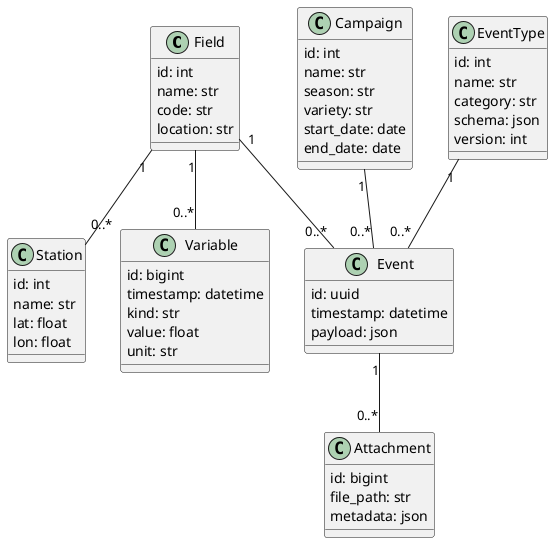

# 1) Visión y alcance

* **Visión**: Centralizar la trazabilidad del cultivo de limón —desde labores en campo hasta poscosecha— con consulta web y consumo por API, permitiendo registrar y auditar eventos agronómicos y variables ambientales/operativas.
* **Alcance inicial**:

  * Registro y consulta de **eventos base** (riego, fertilización, fitosanitarios, labores, monitoreo y brotes de plagas/enfermedades, clima, cosecha, almacenamiento/poscosecha, mano de obra/costos) y **variables clave** (humedad del suelo, temperatura, HR, precipitación, NDVI/NDRE), tomando como referencia tu documento de bitácora y variables IoT. 
  * **Definición y alta de eventos dinámicos** (no cerrarse a N tipos fijos).
  * API REST para consulta/ingesta.
  * Auditoría y trazabilidad por lote/parcela.

# 2) Actores/usuarios

* **Administrador** (define catálogos, permisos, tipos de evento).
* **Técnico de campo** (captura eventos vía web/móvil).
* **Supervisor/Calidad** (audita, consulta reportes).
* **Integraciones** (consumen/inyectan datos por API).

# 3) Características clave (high-level)

* **Eventos base predefinidos** + **creación de eventos dinámicos** (campos personalizables).
* **Asociación por Lote/Parcela y Campaña**.
* **Adjuntos** (fotos/archivos, ej. etiquetas de producto/lotes).
* **Variables ambientales/IoT** y correlación básica con eventos (ej. eficacia de riego vs. Δhumedad; fertilización vs. NDRE; ventanas climáticas para fitosanitarios). 
* **Reportes/consultas** por fechas, lote, tipo de evento, responsable.
* **API REST** (DRF) con autenticación, paginación y filtros.
* **Auditoría** (quién, cuándo, qué cambió).

# 4) Requerimientos funcionales (RF)

1. **RF-01**: Gestionar **Lotes/Parcelas** (CRUD, georreferencia opcional).
2. **RF-02**: Registrar **Campañas** (año/temporada, variedad).
3. **RF-03**: Alta de **Eventos base** de trazabilidad (riego, fertilización, fitosanitarios, labores, monitoreo/brotes, clima, cosecha, poscosecha, mano de obra/costos), con campos sugeridos por tu documento. 
4. **RF-04**: **Eventos dinámicos**: el admin puede crear nuevos **tipos de evento** con **esquema de campos** (obligatorios/opcionales, tipos, unidades).
5. **RF-05**: Captura de **Variables** (manual o por API: IoT) asociadas a Estación/Lote/Fecha.
6. **RF-06**: Adjuntar **evidencias** (fotos, PDF, CSV) por evento.
7. **RF-07**: **Consulta** por filtros (rango de fechas, tipo, lote, responsable, campaña, variable).
8. **RF-08**: **KPIs básicos** (ej.: Δhumedad post-riego / mm aplicados; ΔNDRE vs kg nutriente). 
9. **RF-09**: **API REST** para CRUD de catálogos, lectura/escritura de eventos, lectura de variables y adjuntos (subida autenticada).
10. **RF-10**: **Auditoría**: histórico de cambios y logs de API.

# 5) Requerimientos no funcionales (RNF)

* **RNF-01**: Backend Python 3.11+, **Django 5 + Django REST Framework**.
* **RNF-02**: BD recomendada: **PostgreSQL** (por **JSONB** para eventos dinámicos).
* **RNF-03**: Autenticación **JWT** o **Session+CSRF** (web), **JWT** (API).
* **RNF-04**: **Paginación** y **filtros** en API; **rate limiting** para integraciones.
* **RNF-05**: **Timestamps y zona horaria** consistente (America/Mexico_City).
* **RNF-06**: **Testing** (pytest) y **CI** básico.
* **RNF-07**: **RBAC** simple (Admin, Técnico, Supervisor, Integración).
* **RNF-08**: **CORS** configurable; **OpenAPI/Swagger** auto-generado.
* **RNF-09**: **Backups** y **migraciones** gestionadas (Django migrations).
* **RNF-10**: **Observabilidad** (logs estructurados; métricas).

# 6) Modelo de dominio (clases base)

Pensado para separar **tipo de evento** (definición) de **instancias de evento** (datos reales capturados), habilitando **dinamismo**:

* **Organization** (opcional multi-tenant)
* **Field (Lote/Parcela)**: `name`, `code`, `location`, `geometry` (opcional)
* **Campaign**: `name`, `season`, `variety`, `start_date`, `end_date`
* **Station** (clima/IoT): `name`, `field`, `lat`, `lon`
* **EventType**: `name`, `category` (riego/fertilización/etc.), `schema` (JSON Schema/propio), `version`
* **Event**: `event_type`, `field`, `campaign`, `timestamp`, `payload` (JSONB), `created_by`
* **Attachment**: `event`, `file`, `metadata`
* **Variable**: `station|field`, `timestamp`, `kind` (ej. soil_moisture, temp, RH, rain, NDVI), `value`, `unit`
* **User** / **Role** / **AuditLog**

> **Notas**
>
> * Los **eventos base** pueden venir pre-cargados como `EventType` con esquemas (riego, fertilización, fitosanitarios, labores, monitoreo/brotes, clima, cosecha, poscosecha, mano de obra), según tu documento. 
> * El **payload JSONB** permite **agregar campos nuevos** sin migraciones.
> * Para validación, usar **JSON Schema** guardado en `EventType.schema`.

# 7) Esquema de base de datos (propuesta)

**PostgreSQL** (simplificado):

```sql
-- Catálogos
CREATE TABLE field (
  id SERIAL PRIMARY KEY,
  name TEXT NOT NULL,
  code TEXT UNIQUE,
  location TEXT,
  geom GEOGRAPHY,          -- opcional (PostGIS)
  created_at TIMESTAMPTZ DEFAULT now()
);

CREATE TABLE campaign (
  id SERIAL PRIMARY KEY,
  name TEXT NOT NULL,
  season TEXT,
  variety TEXT,
  start_date DATE,
  end_date DATE
);

CREATE TABLE station (
  id SERIAL PRIMARY KEY,
  field_id INT REFERENCES field(id),
  name TEXT NOT NULL,
  lat DOUBLE PRECISION,
  lon DOUBLE PRECISION
);

-- Definición de tipos de evento (dinámicos)
CREATE TABLE event_type (
  id SERIAL PRIMARY KEY,
  name TEXT NOT NULL,
  category TEXT,           -- riego, fertilización, etc.
  schema JSONB NOT NULL,   -- JSON Schema de validación
  version INT DEFAULT 1,
  is_active BOOLEAN DEFAULT TRUE
);

-- Instancia de evento
CREATE TABLE event (
  id UUID PRIMARY KEY DEFAULT gen_random_uuid(),
  event_type_id INT REFERENCES event_type(id),
  field_id INT REFERENCES field(id),
  campaign_id INT REFERENCES campaign(id),
  timestamp TIMESTAMPTZ NOT NULL,
  payload JSONB NOT NULL,  -- datos capturados
  created_by INT,          -- user_id
  created_at TIMESTAMPTZ DEFAULT now()
);

CREATE INDEX idx_event_field_time ON event(field_id, timestamp);
CREATE INDEX idx_event_type ON event(event_type_id);
CREATE INDEX idx_event_payload_gin ON event USING gin (payload);

-- Variables ambientales / IoT
CREATE TABLE variable (
  id BIGSERIAL PRIMARY KEY,
  station_id INT REFERENCES station(id),
  field_id INT REFERENCES field(id),
  timestamp TIMESTAMPTZ NOT NULL,
  kind TEXT NOT NULL,      -- soil_moisture, temp, RH, rain, NDVI, NDRE...
  value DOUBLE PRECISION,
  unit TEXT
);
CREATE INDEX idx_variable_kind_time ON variable(kind, timestamp);

-- Adjuntos
CREATE TABLE attachment (
  id BIGSERIAL PRIMARY KEY,
  event_id UUID REFERENCES event(id),
  file_path TEXT NOT NULL,
  metadata JSONB,
  created_at TIMESTAMPTZ DEFAULT now()
);

-- Auditoría básica
CREATE TABLE audit_log (
  id BIGSERIAL PRIMARY KEY,
  actor_id INT,
  action TEXT,             -- create_event, update_event, api_read, etc.
  entity TEXT,             -- event/variable/field...
  entity_id TEXT,
  at TIMESTAMPTZ DEFAULT now(),
  diff JSONB               -- antes/después
);
```

> **Eventos base sugeridos** (precargados en `event_type`): riego; fertilización; fitosanitarios; labores; monitoreo de plagas/enfermedades; brotes; clima; cosecha; poscosecha; mano de obra/costos. **Variables top**: humedad de suelo, temp aire, HR, precipitación, NDVI/NDRE. 

# 8) Validación para eventos dinámicos

* Guardar en `event_type.schema` un **JSON Schema** con:

  * `properties` (tipo, unidad, rangos)
  * `required`
  * `enum` (cuando aplique)
* Al crear/actualizar un `event.payload`, validar contra el schema (ej. `jsonschema` en Python).
* Versionar `event_type` si cambian campos; mantener lectura retro-compatible.

# 9) API (v1) — Rutas y ejemplos (DRF)

**Autenticación**: JWT.

* `POST /api/v1/auth/login/` → tokens
* `GET /api/v1/fields/?q=&page=`
* `GET /api/v1/campaigns/`
* `GET /api/v1/event-types/`
* `POST /api/v1/event-types/` (admin, define schema)
* `GET /api/v1/events/?field_id=&type_id=&from=&to=&campaign_id=`
* `POST /api/v1/events/`

  ```json
  {
    "event_type_id": 3,
    "field_id": 12,
    "campaign_id": 5,
    "timestamp": "2025-10-13T08:30:00-06:00",
    "payload": {
      "metodo": "goteo",
      "duracion_min": 90,
      "volumen_m3": 45,
      "presion_bar": 1.8,
      "ce_uScm": 850,
      "ph": 6.7
    }
  }
  ```
* `GET /api/v1/variables/?field_id=&station_id=&kind=&from=&to=`
* `POST /api/v1/variables/` (ingesta IoT o manual)
* `POST /api/v1/events/{id}/attachments/` (multipart)
* `GET /api/v1/reports/kpis-riego?field_id=&from=&to=` (ej. Δhumedad post-riego / mm aplicados). 
* `GET /api/v1/health/` (status, versión)

**Notas de API**

* **Paginación**: `?page=1&page_size=50`.
* **Filtros** robustos por fecha/lote/tipo.
* **OpenAPI/Swagger** auto-doc.

# 10) UI (Django + HTMX/Alpine o React, a elección)

* **Dashboard**: KPIs de campaña, últimos eventos, alertas (ventanas climáticas).
* **Mapa** (opcional): Lotes y estaciones.
* **Captura**: formularios dinámicos según `EventType.schema`.
* **Consultas/Reportes**: tabla filtrable, exportables CSV/Excel.
* **Administración**: CRUD de catálogos, `EventType` y esquema de campos.

# 11) Seguridad y cumplimiento

* **RBAC** (Admin/Técnico/Supervisor/Integración).
* **Auditoría** completa (API + UI).
* **Backups** diarios; rotación de logs; control de acceso a adjuntos (URL firmadas).
* **CORS** por dominio.

# 12) Arquitectura de proyecto (apps Django sugeridas)

```
core/        (users, roles, audit, utils)
fields/      (lotes, campañas, estaciones)
events/      (event_type, event, attachments, validators)
variables/   (ingesta y consulta de variables)
api/         (DRF routers, serializers, auth)
ui/          (vistas web)
reports/     (kpis, exportaciones)
```

# 13) PlantUML — Modelo de dominio (simplificado)

> Puedes pegarlo en plantuml.com para visualizarlo.



# 14) Roadmap sugerido (primeras 4–6 semanas)

1. **Semana 1**: Setup (Django/DRF, Postgres, auth, RBAC, base models).
2. **Semana 2**: `EventType` + validación JSON Schema; CRUD de `Field`, `Campaign`, `Station`.
3. **Semana 3**: `Event` + adjuntos + filtros + auditoría.
4. **Semana 4**: `Variable` + endpoints + primeras correlaciones/KPIs simples. 
5. **Semana 5**: UI de captura y consulta; exportaciones.
6. **Semana 6**: Endpoints de reportes, Swagger completo, pruebas e2e.

---
